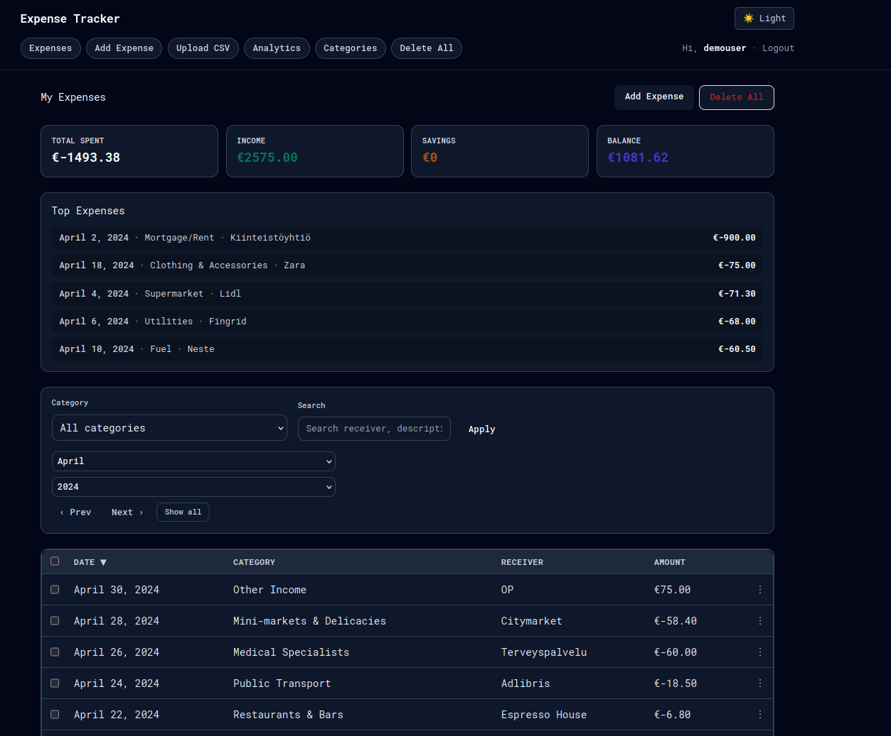
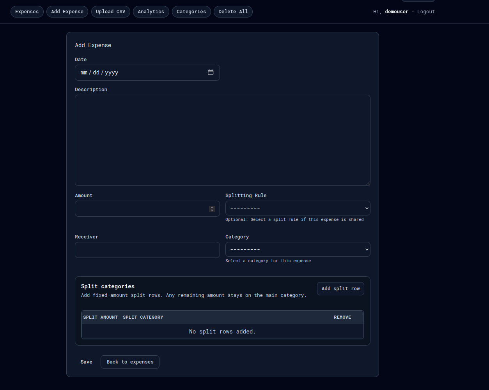
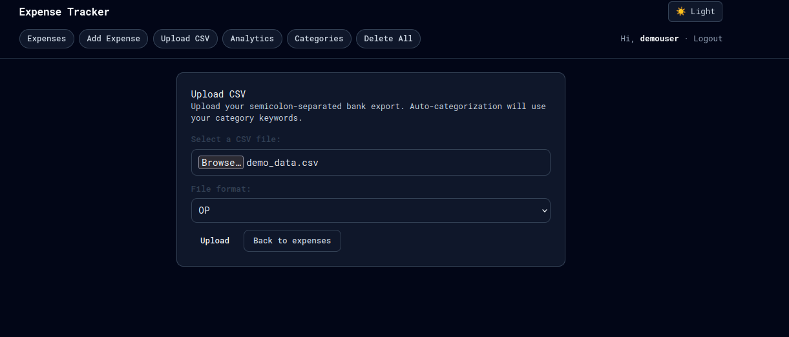
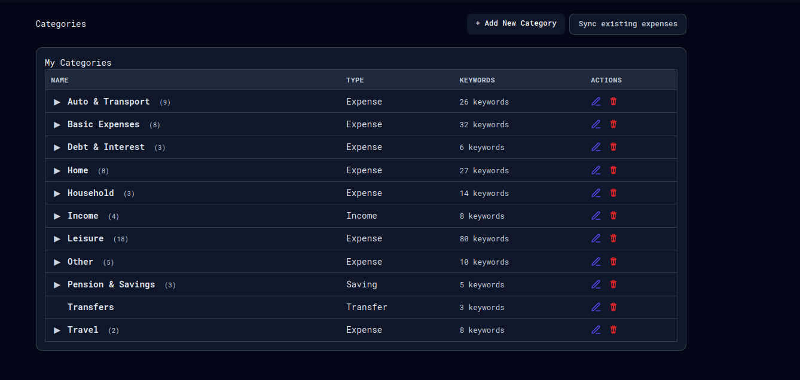
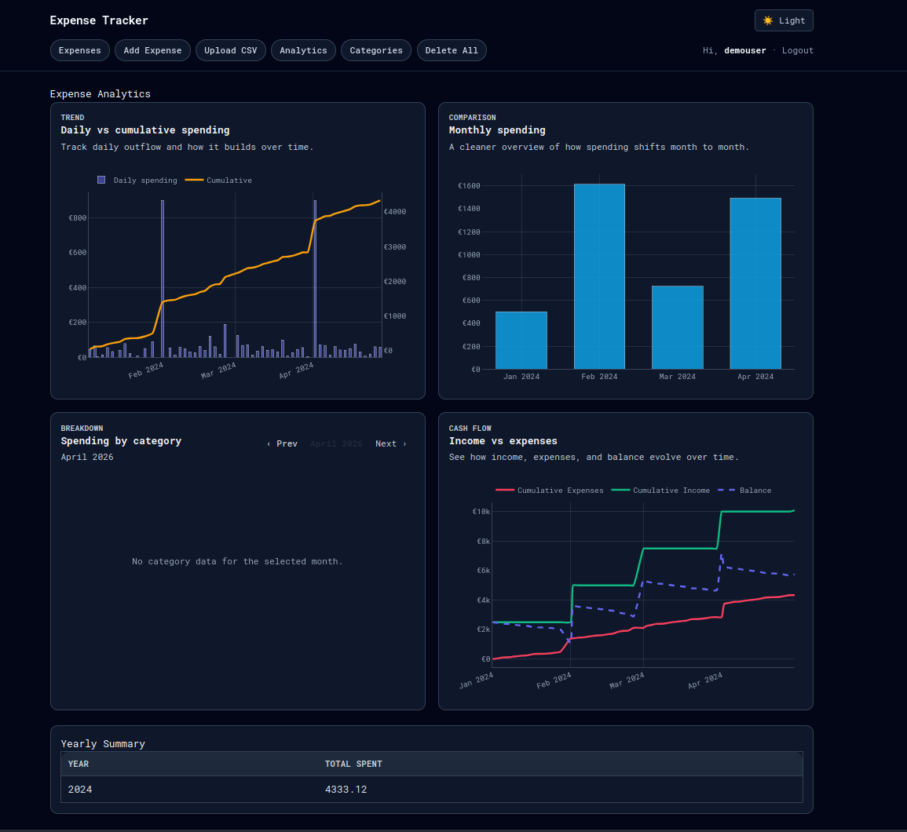

# Expense Tracker

A personal finance web app for tracking expenses and income, built with Django. Import transactions from your bank's CSV export, auto-categorize them, and visualize spending trends with interactive charts.

> Personal project built while learning Django.

## Screenshots

### Dashboard


The main dashboard shows **Total Spent**, **Income**, **Savings**, and **Balance** summary cards, a **Top Expenses** list, and a filterable transaction table with search, category, month, and year filters.

### Adding Expenses


Manually log transactions with date, description, amount, receiver, and category. Supports **Splitting Rules** for shared costs and per-transaction **Split Categories** to allocate amounts across multiple categories.

### CSV Import


Bulk-import transactions from your bank's CSV export. Select your bank's file format and upload — transactions are auto-categorized based on your keyword rules.

### Categories


Define custom categories with keyword-based auto-categorization. Assign a type (Expense, Income, Saving, Transfer) and keywords to match incoming transactions. Use **Sync existing expenses** to re-apply rules to historical data.

### Analytics


Interactive Plotly charts showing daily vs. cumulative spending, monthly comparisons, spending by category, and cash flow over time. Includes a yearly summary table.

## Tech Stack

- **Python 3.13** / **Django 5.2**
- **Plotly 6.4** — interactive charts
- **SQLite** — local database
- **uv** — dependency management

## Getting Started

### Prerequisites

- Python 3.13+
- [uv](https://docs.astral.sh/uv/)

### Setup

```bash
git clone https://github.com/andomm/expense-tracker.git
cd expense-tracker

# Install dependencies
uv sync

# Apply database migrations
uv run --directory expense_tracker python manage.py migrate

# Create an admin user
uv run --directory expense_tracker python manage.py createsuperuser

# Start the development server
uv run --directory expense_tracker python manage.py runserver
```

Open [http://127.0.0.1:8000](http://127.0.0.1:8000) in your browser.

### Demo Data

A sample CSV file (`demo_data.csv`) is included with realistic dummy transactions in the OP bank format. Upload it via the CSV import page to quickly populate the app with data for testing.

## CSV Import Formats

Two bank export formats are supported:

### OP (Osuuspankki) CSV

Semicolon-delimited with Finnish column headers:

| Column | Description |
|---|---|
| `Arvopäivä` | Transaction date |
| `Selitys` | Description |
| `Määrä EUROA` | Amount (negative = expense, positive = income) |
| `Saaja/Maksaja` | Receiver / payer |
| `Viesti` | Message / note |

Decimal commas (`,`) are handled automatically.

### Spiir CSV

Semicolon-delimited export from the [Spiir](https://spiir.dk) app:

| Column | Description |
|---|---|
| `Date` | Transaction date (`DD-MM-YYYY`) |
| `Amount` | Amount |
| `Text` | Receiver / payer |
| `Note` | Description / note |
| `Category` | Category label |

## Running Tests

```bash
uv run --directory expense_tracker python manage.py test
```
